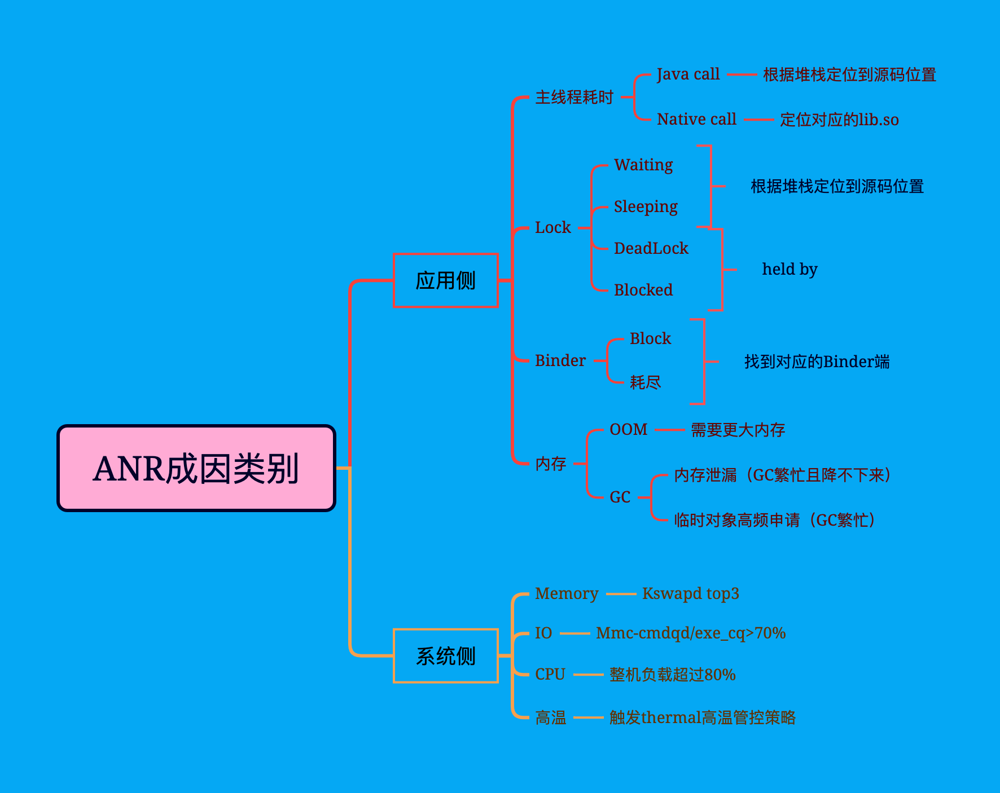
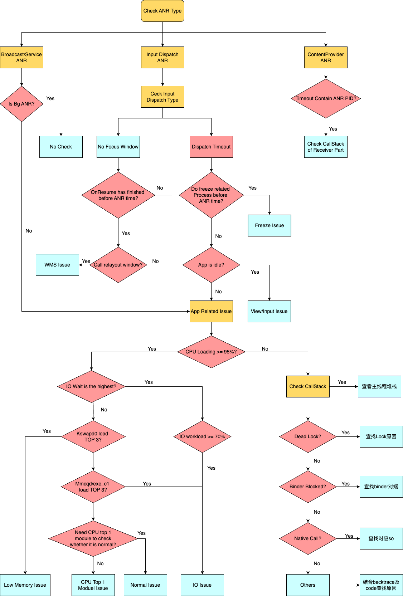

> 本篇开始整理一些关于ANR的知识，包括：分类，分析流程，基础知识，实例，以及原理等。
>
> 由于本人技术水平有限，而ANR的问题涉及整个系统的影响，因此很多复杂的ANR，或者系统ANR本人无法解决。
>
> 另外，由于本人对于系统层知识了解比较浅显，因此很多ANR问题也只能分类或者很多找到的原因不太准确，还是需要读者自己去深入学习。

## ANR分类

- Service Timeout：前台服务在20s内未执行完成，后台为200s；
- BroadcastQueue Timeout：前台广播在10s内未执行完成，后台为60s；
- ContentProvider Timeout：内容提供者在publish超时10s;
- InputDispatching Timeout：输入事件分发超时5s，包括按键和触摸事件；
- 后台的anr，即isSilentANR值为true，那么不显示ANR对话框，直接kill掉ANR所在进程；
- 如果内部框架有问题比如窗口管理器存在死锁也不会显示ANR对话框，但最后会触发安卓 WatchDog 超时；

## ANR成因类别

对于ANR成因类别，根据网上资料我重新绘制了一张思维导图帮助来帮助记忆。

我们在遇到ANR问题时可以根据这些知识点去区分是应用侧的还是系统侧的，以便准确的人去分析ANR问题。

## ANR分析流程

下图是一个ANR分析流程图，该图也是我根据网上的ANR流程图重新绘制的，这样保证图比较清晰。

因为ANR问题很复杂，因此如果有一个分析流程对我们分析ANR肯定是有帮助的，能够让我们更快的找到对应的原因或者是哪部分的问题。

该图涉及的内容很多，后面我会根据我工作中遇到的ANR问题实例以及网上的一些资料，还有ANR涉及的log信息，以及分析基础知识做更多的分析。
