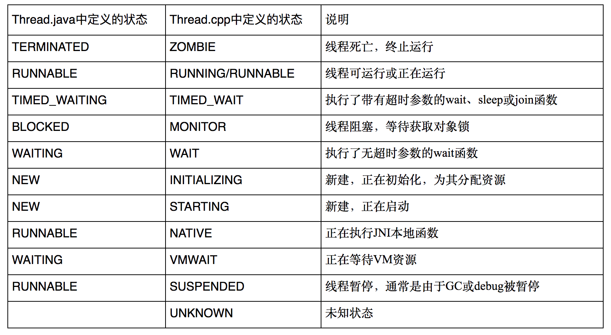

# ANR-分析之基础知识介绍：trace信息


上一章[ANR-分类以及分析流程](https://codemx.cn/2024/08/17/ANR01/)介绍了ANR分类，ANR成因分类，以及ANR分析流程。这一章介绍一下分析ANR需要的基础知识。


## 分析ANR问题需要一些信息

* trace信息
  * 通过抓取bugreport获取，通常位于bugreport/FS/ANR/目录下。
* event log信息
  * 通过抓取bugreport或者debuglog信息获取
* logcat信息，
  * 通过抓取bugreport或者debuglog信息获取
* systemtrace信息。
  * 通过命令抓取

由于信息比较多，这章先看一下trace信息


## trace信息解释

首先通过下面trace信息介绍一下包含哪些信息，

```SQL
// 发生ANR的进程id、时间和进程名称。
----- pid 2023 at 2018-07-24 19:33:17 -----
// 发生ANR的包名
Cmd line: com.rui.android.poc

// 下面三行是线程的基本信息
// CheckJNI is off：表示Java Native Interface (JNI) 检查功能被关闭。这意味着JNI调用不会进行额外的错误检查，
// 可能提高性能，但也可能导致潜在的错误被忽视。
// workarounds are off：表示所有的临时解决方案（workarounds）被禁用，这可能是为了追求性能或专注于应用的正常行为。
// pins=0：表示当前没有JNI引用被“固定”在内存中，这意味着没有活动的JNI引用指向Java对象。
// globals=348：表示当前存在348个全局引用。在JNI中，全局引用是指由C/C++代码持有的对Java对象的引用，这些对象不会被垃圾回收。
JNI: CheckJNI is off; workarounds are off; pins=0; globals=348
DALVIK THREADS: // 此部分将列出各个Dalvik虚拟机线程的状态和堆栈信息
// tll=0：当前线程锁的数量（Thread Local Locks）。
// tsl=0：表示当前持有的可重入锁的数量（Thread-Safe Locks）。
// tscl=0：表示当前持有的可重入锁中被其他线程锁定的数量（Thread-Safe Contention Locks）。
// ghl=0：表示全局锁的数量（Global Locks）。
(mutexes: tll=0 tsl=0 tscl=0 ghl=0)

// 下面一行说明了线程名称、daemon表示守护进程，线程的优先级（默认5）、线程锁id和线程状态，
// 线程名称是启动线程的时候手动指明的，这里的main标识是主线程，是Android自动设定的
// 一个线程名称，如果是自己手动创建的线程，一般会被命名成“Thread-xx”的格式，其中xx是
// 线程id，它只增不减不会被复用；注意这其中的tid不是线程的id,它是一个在Java虚拟机中用
// 来实现线程锁的变量，随着线程的增减，这个变量的值是可能被复用的；
"main" prio=5 tid=1 NATIVE // 线程状态

// group：是线程组名称。
// sCount：是此线程被挂起的次数，当一个进程被调试后，sCount会重置为0，调试完毕后sCount会根据是否被正常挂起增长，
// dsCount：是线程被调试器挂起的次数，dsCount不会被重置为0，所以dsCount也可以用来判断这个线程是否被调试过
// obj：表示这个线程的Java对象的地址，
// self：表示这个线程Native的地址。
  | group="main" sCount=1 dsCount=0 obj=0x4164dcf0 self=0x41565628

// 此后是线程的调度信息，
// sysTid：是Linux下的内核线程id，
// nice：是线程的调度优先级，
// sched：分别标志了线程的调度策略和优先级，
// cgrp：是调度属组，
// handle：是线程的处理函数地址。
  | sysTid=2023 nice=-1 sched=0/0 cgrp=apps handle=1074626900

// 线程当前上下文信息，
// state：是调度状态；
// schedstat：从 /proc/[pid]/task/[tid]/schedstat读出，
// 三个值分别表示线程在cpu上执行的时间、线程的等待时间和线程执行的时间片长度，有的
// android内核版本不支持这项信息，得到的三个值都是0；
// utm：是线程用户态下使用的时间值(单位是jiffies）;
// stm：是内核态下的调度时间值；
// core：是最后执行这个线程的cpu核的序号。
  | state=S schedstat=( 0 0 0 ) utm=49 stm=21 core=0

// 线程的调用栈信息(这里可查看导致ANR的代码调用流程，分析ANR最重要的信息)
  (native backtrace unavailable)
  at libcore.io.Posix.open(Native Method)
  at libcore.io.BlockGuardOs.open(BlockGuardOs.java:110)
  at libcore.io.IoBridge.open(IoBridge.java:430)
  at java.io.FileInputStream.<init>(FileInputStream.java:78)
  at com.ruiven.android.Peripheral.util.kingFiles.write(kingFiles.java:58)
  at com.ruiven.android.Peripheral.util.kingFiles.write(kingFiles.java:51)
  at com.ruiven.android.Peripheral.util.kingLog.writeToFiles(kingLog.java:71)
  at com.ruiven.android.Peripheral.util.kingLog.f(kingLog.java:47)
  at com.ruiven.android.poc.receiver.ReceiverBatteryChanged.onReceive(ReceiverBatteryChanged.java:114)
  at android.app.LoadedApk$ReceiverDispatcher$Args.run(LoadedApk.java:767)
  at android.os.Handler.handleCallback(Handler.java:769)
  at android.os.Handler.dispatchMessage(Handler.java:97)
  at android.os.Looper.loop(Looper.java:136)
  at com.ruiven.android.Peripheral.util.Cockroach$1.run(Cockroach.java:38)
  at android.os.Handler.handleCallback(Handler.java:769)
  at android.os.Handler.dispatchMessage(Handler.java:97)
  at android.os.Looper.loop(Looper.java:136)
  at android.app.ActivityThread.main(ActivityThread.java:5375)
  at java.lang.reflect.Method.invokeNative(Native Method)
  at java.lang.reflect.Method.invoke(Method.java:515)
  at com.android.internal.os.ZygoteInit$MethodAndArgsCaller.run(ZygoteInit.java:976)
  at com.android.internal.os.ZygoteInit.main(ZygoteInit.java:792)
  at dalvik.system.NativeStart.main(Native Method)
// Binder线程是进程的线程池中用来处理binder请求的线程
"Binder_3" prio=5 tid=23 NATIVE
  | group="main" sCount=1 dsCount=0 obj=0x41b765f8 self=0x4f213f18
  | sysTid=1347 nice=0 sched=0/0 cgrp=apps handle=1327603952
  | state=S schedstat=( 0 0 0 ) utm=0 stm=3 core=1
  #00  pc 000205d0  /system/lib/libc.so (__ioctl+8)
  #01  pc 0002d01f  /system/lib/libc.so (ioctl+14)
  #02  pc 0001e519  /system/lib/libbinder.so (android::IPCThreadState::talkWithDriver(bool)+140)
  #03  pc 0001ec67  /system/lib/libbinder.so (android::IPCThreadState::getAndExecuteCommand()+6)
  #04  pc 0001ecfd  /system/lib/libbinder.so (android::IPCThreadState::joinThreadPool(bool)+48)
  #05  pc 000236cd  /system/lib/libbinder.so
  #06  pc 0000ea19  /system/lib/libutils.so (android::Thread::_threadLoop(void*)+216)
  #07  pc 0004e769  /system/lib/libandroid_runtime.so (android::AndroidRuntime::javaThreadShell(void*)+68)
  #08  pc 0000e54b  /system/lib/libutils.so
  #09  pc 0000d240  /system/lib/libc.so (__thread_entry+72)
  #10  pc 0000d3dc  /system/lib/libc.so (pthread_create+240)
  at dalvik.system.NativeStart.run(Native Method)
// JDWP线程是支持虚拟机调试的线程，daemon表示守护进程，不需要关心
"JDWP" daemon prio=5 tid=4 VMWAIT
  | group="system" sCount=1 dsCount=0 obj=0x41a21868 self=0x4cc821b0
  | sysTid=785 nice=0 sched=0/0 cgrp=apps handle=1257589656
  | state=S schedstat=( 0 0 0 ) utm=0 stm=0 core=1
  #00  pc 00021420  /system/lib/libc.so (recvmsg+8)
  #01  pc 000668ab  /system/lib/libdvm.so
  #02  pc 00066adf  /system/lib/libdvm.so
  #03  pc 000697af  /system/lib/libdvm.so
  #04  pc 00059fdd  /system/lib/libdvm.so
  #05  pc 0000d240  /system/lib/libc.so (__thread_entry+72)
  #06  pc 0000d3dc  /system/lib/libc.so (pthread_create+240)
  at dalvik.system.NativeStart.run(Native Method)
// “Signal Catcher”负责接收和处理kernel发送的各种信号，例如SIGNAL_QUIT、SIGNAL_USR1等就是被该线程
// 接收到并处理的，traces.txt 文件中的内容就是由该线程负责输出的，可以看到它的状态是RUNNABLE.
"Signal Catcher" daemon prio=5 tid=3 RUNNABLE
  | group="system" sCount=0 dsCount=0 obj=0x41a21770 self=0x4af3e5e0
  | sysTid=784 nice=0 sched=0/0 cgrp=apps handle=1257677168
  | state=R schedstat=( 0 0 0 ) utm=2 stm=2 core=1
  at dalvik.system.NativeStart.run(Native Method)
----- end 2023 -----
```

## 线程状态



```
***特别说明一下MONITOR状态和SUSPEND状态，MONITOR状态一般是类的同步块或者同步方法造成的，SUSPENDED状态在debugger的时候会出现，可以用来区别是不是真的是用户正常操作跑出了ANR。*

mutexes(互斥)的选项简写对应含义：
tll--thread list lock
tsl-- thread suspend lock
tscl-- thread suspend count lock
ghl--gc heap lock
hwl--heap worker lock
hwll--heap worker list lock
```

注意

```
trace信息中的线程状态是CPP状态
main线程处于 BLOCK、WAITING、TIMEWAITING状态，那基本上是函数阻塞导致ANR； 如果main线程无异常，则应该排查CPU负载和内存环境。
```

## 实例

> 这里是出现几种线程状态的实例。

TIMED_WAIT状态

```SQL
DALVIK THREADS:
"main" prio=5 tid=3 TIMED_WAIT
  | group="main" sCount=1 dsCount=0 s=0 obj=0x400143a8
  | sysTid=691 nice=0 sched=0/0 handle=-1091117924
  at java.lang.Object.wait(Native Method)
  - waiting on <0x1cd570> (a android.os.MessageQueue)
  at java.lang.Object.wait(Object.java:195)
  at android.os.MessageQueue.next(MessageQueue.java:144)
  at android.os.Looper.loop(Looper.java:110)
  at android.app.ActivityThread.main(ActivityThread.java:3742)
  at java.lang.reflect.Method.invokeNative(Native Method)
  at java.lang.reflect.Method.invoke(Method.java:515)
  at com.android.internal.os.ZygoteInit$MethodAndArgsCaller.run(ZygoteInit.java:739)
  at com.android.internal.os.ZygoteInit.main(ZygoteInit.java:497)
  at dalvik.system.NativeStart.main(Native Method)

"Binder Thread #3" prio=5 tid=15 NATIVE
  | group="main" sCount=1 dsCount=0 s=0 obj=0x434e7758
  | sysTid=734 nice=0 sched=0/0 handle=1733632
  at dalvik.system.NativeStart.run(Native Method)

"Binder Thread #2" prio=5 tid=13 NATIVE
  | group="main" sCount=1 dsCount=0 s=0 obj=0x1cd570
  | sysTid=696 nice=0 sched=0/0 handle=1369840
  at dalvik.system.NativeStart.run(Native Method)

"Binder Thread #1" prio=5 tid=11 NATIVE
  | group="main" sCount=1 dsCount=0 s=0 obj=0x433aca10
  | sysTid=695 nice=0 sched=0/0 handle=1367448
  at dalvik.system.NativeStart.run(Native Method)
```

Suspended状态

```SQL
"main" prio=5 tid=1 Suspended
  | group="main" sCount=1 dsCount=0 cgrp=bg_non_interactive handle=0x7fa2a39000
  | sysTid=16770 nice=-4 sched=0/0 cgrp=bg_non_interactive handle=0x7fa2a39000
  | state=S schedstat=( 2661049558440 288674775480 3568435 ) utm=226454 stm=39650 core=1 HZ=100
  | heldMutexes=
 at android.os.MessageQueue.removeMessages(MessageQueue.java:702)
 at android.os.Handler.removeCallbacks(Handler.java:487)
 at me.ele.android.lmagex.b$3.println(SourceFile:103)
 at android.os.Looper.loop(Looper.java:153)
 at android.app.ActivityThread.main(ActivityThread.java:5665)
 at java.lang.reflect.Method.invoke!(Native Method)
 at com.android.internal.os.ZygoteInit$MethodAndArgsCaller.run(ZygoteInit.java:822)
 at com.android.internal.os.ZygoteInit.main(ZygoteInit.java:712)
```

Waiting状态

```SQL
"main" prio=5 tid=1 Waiting
  | group="main" sCount=0 dsCount=0 flags=0 obj=0x731a0ec8 self=0xb40000753e8b6c00
  | sysTid=28146 nice=-10 cgrp=default sched=0/0 handle=0x753fe804f8
  | state=? schedstat=( 0 0 0 ) utm=0 stm=0 core=0 HZ=100
  | stack=0x7fd0403000-0x7fd0405000 stackSize=8192KB
  | held mutexes=
  at java.lang.Object.wait(Native method)
  - waiting on <0x025d68dd> (a android.opengl.GLSurfaceView$GLThreadManager)
  at java.lang.Object.wait(Object.java:442)
  at java.lang.Object.wait(Object.java:568)
  at android.opengl.GLSurfaceView$GLThread.onPause(GLSurfaceView.java:1731)
  at android.opengl.GLSurfaceView.onPause(GLSurfaceView.java:579)
  at com.amap.api.mapcore.util.e.onPause(SourceFile:117)
  at com.amap.api.mapcore.util.e.onDetachedGLThread(SourceFile:73)
  at com.amap.api.mapcore.util.c.destroy(SourceFile:5750)
  at com.amap.api.mapcore.util.t.onDestroy(SourceFile:207)
  at com.amap.api.maps.MapView.onDestroy(SourceFile:165)
```

